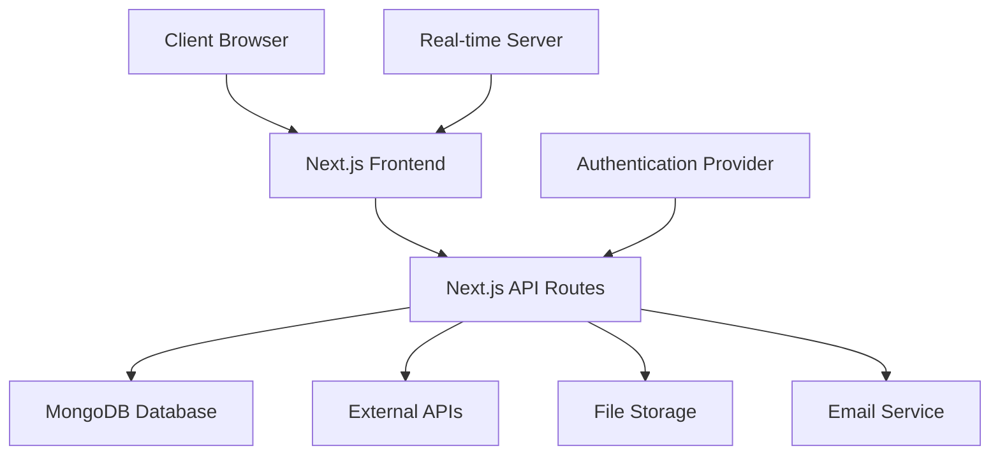

# Task Management System for Video Shooting Projects - Architecture Plan

## Overview
This document outlines the architecture and design for a comprehensive task management system tailored for video shooting projects. The system will support end-to-end project lifecycle management from ideation to delivery, with advanced features for team collaboration, resource management, and performance monitoring.

## Technology Stack
- **Frontend**: Next.js 14 with React 18, TypeScript
- **Styling**: Tailwind CSS with shadcn/ui components
- **Backend**: Next.js API routes (Node.js)
- **Database**: MongoDB with Mongoose ODM
- **Authentication**: NextAuth.js with JWT
- **Real-time Features**: Socket.io
- **Calendar Integration**: FullCalendar
- **Charts & Analytics**: Chart.js and D3.js
- **File Storage**: Local storage for prototype (AWS S3 in production)
- **Email Notifications**: Nodemailer
- **Deployment**: Vercel for frontend, MongoDB Atlas for database

## System Architecture

### High-Level Architecture Diagram


### Database Schema

#### Users Collection
```javascript
{
  _id: ObjectId,
  name: String,
  email: String,
  password: String (hashed),
  role: Enum ['admin', 'project_manager', 'crew_member'],
  avatar: String,
  createdAt: Date,
  updatedAt: Date
}
```

#### Projects Collection
```javascript
{
  _id: ObjectId,
  name: String,
  description: String,
  clientId: ObjectId (ref: Clients),
  projectManagerId: ObjectId (ref: Users),
  status: Enum ['planning', 'active', 'on_hold', 'completed'],
  budget: Number,
  startDate: Date,
  endDate: Date,
  progress: Number (0-100),
  createdAt: Date,
  updatedAt: Date
}
```

#### Tasks Collection
```javascript
{
  _id: ObjectId,
  projectId: ObjectId (ref: Projects),
  title: String,
  description: String,
  assignedTo: ObjectId (ref: Users),
  status: Enum ['todo', 'in_progress', 'review', 'completed'],
  priority: Enum ['low', 'medium', 'high'],
  dueDate: Date,
  estimatedHours: Number,
  actualHours: Number,
  createdAt: Date,
  updatedAt: Date
}
```

#### Clients Collection
```javascript
{
  _id: ObjectId,
  name: String,
  email: String,
  phone: String,
  company: String,
  address: String,
  createdAt: Date,
  updatedAt: Date
}
```

#### Equipment Collection
```javascript
{
  _id: ObjectId,
  name: String,
  type: String,
  availability: Boolean,
  location: String,
  maintenanceSchedule: Date,
  createdAt: Date,
  updatedAt: Date
}
```

#### Schedules Collection
```javascript
{
  _id: ObjectId,
  projectId: ObjectId (ref: Projects),
  title: String,
  startDate: Date,
  endDate: Date,
  location: String,
  assignedResources: [ObjectId] (ref: Users, Equipment),
  createdAt: Date,
  updatedAt: Date
}
```

## Key Features Implementation

### 1. User Roles and Permissions
- **Admin**: Full access to all features, user management
- **Project Manager**: Project creation, team assignment, budget oversight
- **Crew Member**: Task execution, time logging, limited access

### 2. Real-time Collaboration
- Comments on tasks and projects
- File sharing with drag-and-drop
- Live updates using Socket.io
- Task assignment notifications

### 3. Calendar Integration
- Interactive calendar view for schedules
- Drag-and-drop event management
- Google Calendar sync
- Resource conflict detection

### 4. Dashboards and Analytics
- Project progress Gantt charts
- Kanban boards for task management
- Team productivity metrics
- Revenue forecasting charts

### 5. Client Portal
- Secure login for clients
- Project updates and approvals
- File downloads and feedback submission

### 6. Security Features
- Data encryption at rest and in transit
- JWT-based authentication
- Role-based access control
- Audit logs for all actions

## UI/UX Design

### Key Screens
1. **Dashboard**: Overview of active projects, upcoming deadlines, team metrics
2. **Project List**: Filterable list with status indicators
3. **Project Details**: Tasks, timeline, budget, team members
4. **Calendar View**: Monthly/weekly schedule with resource allocation
5. **Task Board**: Kanban-style task management
6. **Client Portal**: Simplified view for client interactions
7. **Reports**: Analytics and performance metrics
8. **Settings**: User preferences, notifications, integrations

### Design Principles
- Clean, modern interface with intuitive navigation
- Mobile-first responsive design
- Consistent color scheme and typography
- Accessibility compliance (WCAG 2.1)
- Dark mode support

## Implementation Phases

1. **Phase 1**: Project setup, authentication, basic CRUD operations
2. **Phase 2**: Task management, calendar integration, basic dashboards
3. **Phase 3**: Collaboration features, notifications, client portal
4. **Phase 4**: Advanced analytics, integrations, security hardening
5. **Phase 5**: Testing, dummy data population, final refinements

## Dummy Data Structure

### Sample Projects
- Wedding Video Shoot (Client: Sarah & John)
- Corporate Training Video (Client: TechCorp Inc.)
- Product Demo Video (Client: GadgetWorld)

### Sample Team Members
- Admin: John Doe
- Project Managers: Jane Smith, Mike Johnson
- Crew Members: Alice Brown, Bob Wilson, Carol Davis

### Sample Equipment
- Sony A7S III Camera
- DJI Ronin Gimbal
- Sennheiser Microphones
- LED Lighting Kit

## Performance Monitoring
- Page load times < 2 seconds
- API response times < 500ms
- Real-time updates with < 100ms latency
- Mobile performance optimization

## Deployment Strategy
- Frontend: Vercel with automatic deployments
- Database: MongoDB Atlas
- CI/CD: GitHub Actions for automated testing
- Monitoring: Vercel Analytics and custom logging

This plan provides a comprehensive blueprint for building the task management system. The modular architecture allows for incremental development and easy maintenance.